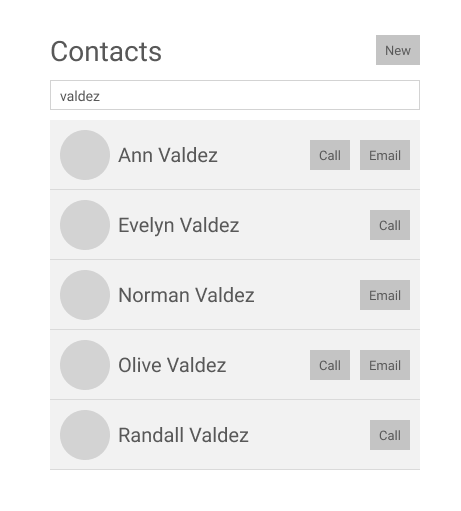
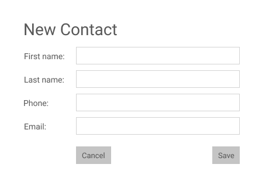

# Access Fintech UI Test

Hi 👋 Thanks for checking out Access Fintech's UI Engineer Test.

For this challenge we would like you to build a small contacts list app, which interacts with a GraphQL API. The app should list all contacts retrieved from the provided API, and allow fuzzy filtering across all properties of each contact. Additionally, we should be able to add a new contact through the form in the app.

You should spend between 1 and 3 hours on the test, but we don't expect everything to be complete to perfection. We're more interested in how you approach the problems, and what you would do to improve the app if it was a real application. So please make notes as you go along.

## Getting started

We have included a mock GraphQL server for you to work against. There are some contacts already created, but the rest of the data will not persist between server reloads. You are not expected to make any changes inside the `server` directory.

To start the server, run `yarn start:api`. You can explore the API at http://localhost:4520.

The rest of the repo is a fresh copy of Create React App. To help you get started, we have included [Apollo Client](https://www.apollographql.com/docs/react/) and configured it to point to the mock API.

We have also included [@apollo/react-hooks](https://www.apollographql.com/docs/react/api/react-hooks/) and [@apollo/react-components](https://www.apollographql.com/docs/react/api/react-components/) - use whichever you are comfortable with. If you would prefer to use a different GraphQL client, please go ahead!

The rest of the stack is up to you, use whatever you enjoy. Our typical stack at Access Fintech includes:

- React with hooks
- GraphQL
- Styled Components
- Cypress

## The Contacts app

The app should list all contacts from the mock API, using the `contacts` query. Each contact has the following properties:

- `firstName` (mandatory)
- `lastName` (mandatory)
- `phone` (optional)
- `email` (optional)

Each contact row should display an avatar, the contact's name, and buttons to call and email the contact if the values are present.

The avatars should be an [Adorable Avatar](http://avatars.adorable.io/#demo), where the identifier is the contact's email address. If the contact does not have an email, use a default avatar with the URL `https://api.adorable.io/avatars/face/eyes4/nose3/mouth7/8e8895`.

There should be an input on screen which allows client-side fuzzy filering of contacts. This means that the filter string will be searched across all properties of all contacts. For example, entering "valde" will filter any contacts whose name, email, or phone number includes the string "valde".

Finally, there should be a "New" button, which presents a form allowing us to add a new contact. The contact should be saved to the server using the `createContact` mutation.

Here are some sample wireframes to get you started:

 

## Submission

**Please do not fork or open PRs against this repository**.

Instead, clone or download the contents of the repo, and push to a repo under your own GitHub account. Then email us a link to your finished solution. We'll take a look, and arrange a call to discuss it with you.
